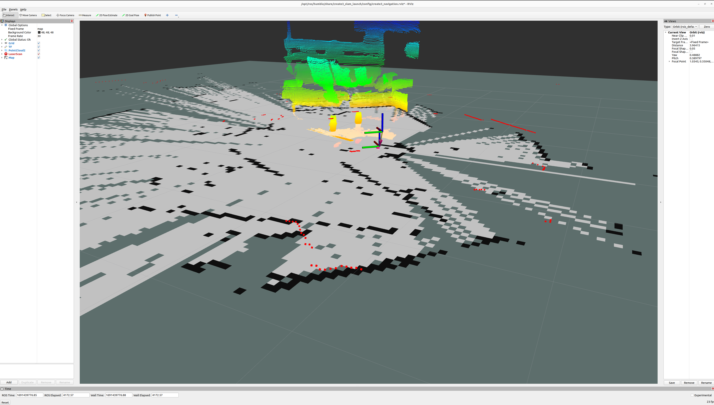

# Project Description
A Mixed Reality "playground" space to visualize and control the iRobot Create3. In this project you can play notes from the Create3, drive it back and forth, visualize SLAM, visualize an RPLIDAR laser scan, visualize a PMD time of flight camera pointcloud, and see the Create3 move in real time all while seeing the real world anchored through the mixed reality passthrough features of the Quest 2
# Materials used
*   [iRobot Create3](https://edu.irobot.com/what-we-offer/create3)
*   [NXP 8M Plus NavQ+](https://emcraft.com/products/1222)
*   [Unity](https://unity.com/)
*   [Ros2 Humble](https://docs.ros.org/en/humble/index.html)
*   [Meta Quest 2](https://www.meta.com/quest/products/quest-2/)
*   [PMD Tof Camera Flexx2](https://3d.pmdtec.com/en/3d-cameras/flexx2/)
*   [Slamtec RPLIDAR A1M8](https://www.amazon.com/Slamtec-RPLIDAR-Scanning-Avoidance-Navigation/dp/B07TJW5SXF)


# Initial Ros2 to Unity Setup
My first step was to connnect the NavQ+ and the Create3 together, I used this [step by step guide](https://iroboteducation.github.io/create3_docs/hw/navqplus_hookup/) from the Create3 docs. Once I had the connection up and running, I verified that I was able to see all of the Ros2 topics being sent from the robot to the NavQ+. Next, I followed the steps to use the Unity Ros TCP Connector package from Unity Robotics Hub in hopes of establishing a working connection between Ros2 on the NavQ+ and my Unity project. I was able to see the topics in Unity, but when I went to use the visualizers only some of the topics would work. This is when I learned about QOS. In order to publish and subscribe to a topic the reciever and the publisher the respective QOS settings must align to this matrix:


| Publisher        | Subscription          | Compatible |
|:-------------|:------------------|:------|
| Best effort           | Best effort | Yes  |
| Best effort | Reliable   | No  |
| Reliable           | Best effort      | Yes   |
| Reliable           | Reliable | Yes  |

The TCP Connector package uses reliable with no way to change it, and most of the topics from the Create3 are best effort with no way to change them as they are locked off. So in order to get around this, I wrote a Ros2 node that subscribes to a topic and republishes it with a new QOS:

```py
import rclpy
from rclpy.node import Node
from sensor_msgs.msg import PointCloud2
from sensor_msgs.msg import Imu
from rclpy.qos import QoSProfile, QoSReliabilityPolicy

class RepeaterNode(Node):
  def __init__(self):
    super().__init__('repeater_node')

    # Configure QoS profiles for the subscriptions and publishers
    qos_profile1 = QoSProfile(
      reliability=QoSReliabilityPolicy.BEST_EFFORT,
      depth=10
    )
    qos_profile2 = QoSProfile(
      reliability=QoSReliabilityPolicy.RELIABLE,
      depth=10
    )

    # Subscription to receive PointCloud2 messages on the cloud topic
    # When a message is received, it will trigger the input_callback method
    self.subscription = self.create_subscription(
      PointCloud2,
      'cloud',
      self.input_callback,
      qos_profile=qos_profile1
    )
    self.subscription1 = self.create_subscription(
      Imu,
      'imu',
      self.input_callback1,
      qos_profile=qos_profile1
    )
    # Publisher to send PointCloud2 messages to unity_cloud topic
    self.publisher = self.create_publisher(
      PointCloud2,
      'unity_cloud',
      qos_profile=qos_profile2
    )
    self.publisher1 = self.create_publisher(
      Imu,
      'unity_imu',
      qos_profile=qos_profile2
    )

  # Callback function for the PointCloud2 subscription
  def input_callback(self, msg):
    modified_msg = msg
    self.publisher.publish(modified_msg)
  def input_callback1(self, msg):
    modified_msg = msg
    self.publisher1.publish(modified_msg)

# Initalize ROS 2 node, create the RepeaterNode and spin the node
def main(args=None):
  rclpy.init(args=args)
  repeater_node = RepeaterNode()
  rclpy.spin(repeater_node)                                                                                             
  repeater_node.destroy_node()                                                                                          
  rclpy.shutdown()
                                                                                                                        
if __name__ == '__main__':
  main()
```

You also need to  convert all of the create3 messages into C# usable messages, the package is actually able to do this for you. I found the msg folder for the create3 messages in the NavQ+ and then SCPed it over to my host machine and dragged it in my unity project where it converted all the messages into C# message classes for me.  
# Creation of the first publisher
I decided to test out publishing by creating a digital piano that publishes to the cmd_audio topic. I looked at the example publisher script from the package to learn how to publish messages, and then created my own script to publish a note to cmd_audio. Next I created a gui of white buttons and black buttons for the sharp keys, and modified the script to send all the notes. Theres a total of 17 notes, heres what the code looks like modified for only 1:

```c#
using UnityEngine;
using Unity.Robotics.ROSTCPConnector;
using RosMessageTypes.IrobotCreate;

public class MusicPublisher : MonoBehaviour
{
    ROSConnection ros;
    public string topicName = "/cmd_audio";r


    private AudioNoteMsg[] keyC;

    void Start()
    {
        ros = ROSConnection.GetOrCreateInstance();
        ros.RegisterPublisher<AudioNoteVectorMsg>(topicName);
        // Creates a new audio note message with the frequency of 262hz and the duration of 1 second
        keyC = new AudioNoteMsg[] { new AudioNoteMsg(262, new RosMessageTypes.BuiltinInterfaces.DurationMsg(1, 0)) };
    }

    // Each individual note has one of these functions
    public void CNote()
    {
        AudioNoteVectorMsg noteC = new AudioNoteVectorMsg(
            // The header is left blank
            new RosMessageTypes.Std.HeaderMsg(),
            keyC,
            // If this was true, the notes would play over eachother
            false
        );

        ros.Publish(topicName, noteC);
    }
}
```
Finally I mapped each of the keys to the functions on the script.


# Putting the Create3 in Unity
In order to show the robot in Unity I had to retrieve the URDF file and import it into Unity using the URDF importer package. Once it was in, I used the built in tf attachment script and attached it to the robot, enabling it to move/rotate as the robot does in real life.

# Running SLAM
First I attached the RPLIDAR by screwing it in to the top plate and the Pmd Flexx2 by using a 3d printed mount to hold it: 

Then I followed the steps on the [Voxelbotics documentation website](https://voxelbotics.atlassian.net/wiki/spaces/DOC/pages/43188225/iRobot+Create3+SLAM+Setup) in order to configure the Create3 application. On another liux machine I installed and launched rviz and succesfully ran SLAM with the map, pointcloud, and the laser scan on the NAVQ+:



Next I ran the TCP package and in combination with the repeater node I wrote, I was able to visualize the topics:


# Headset MR Setup
I used the [Meta Quest2 documentation website](https://developer.oculus.com/documentation/unity/unity-env-device-setup/) in order to setup the headset with Unity. Next I setup passthrough using their [tutorial](https://developer.oculus.com/documentation/unity/unity-passthrough-gs/)

1.  This is an ordered list following a header.
1.  This is an ordered list following a header.
2.  This is an ordered list following a header.
3.  This is an ordered list following a header.

###### Header 6

| head1        | head two          | three |
|:-------------|:------------------|:------|
| ok           | good swedish fish | nice  |
| out of stock | good and plenty   | nice  |
| ok           | good `oreos`      | hmm   |
| ok           | good `zoute` drop | yumm  |

### There's a horizontal rule below this.

* * *

### Here is an unordered list:

*   Item foo
*   Item bar
*   Item baz
*   Item zip

### And an ordered list:

1.  Item one
1.  Item two
1.  Item three
1.  Item four

### And a nested list:

- level 1 item
  - level 2 item
  - level 2 item
    - level 3 item
    - level 3 item
- level 1 item
  - level 2 item
  - level 2 item
  - level 2 item
- level 1 item
  - level 2 item
  - level 2 item
- level 1 item

### Small image


### Large image


### Definition lists can be used with HTML syntax.

<dl>
<dt>Name</dt>
<dd>Godzilla</dd>
<dt>Born</dt>
<dd>1952</dd>
<dt>Birthplace</dt>
<dd>Japan</dd>
<dt>Color</dt>
<dd>Green</dd>
</dl>

```
Long, single-line code blocks should not wrap. They should horizontally scroll if they are too long. This line should be long enough to demonstrate this.
```

```
The final element.
```
Text can be **bold**, _italic_, or ~~strikethrough~~.